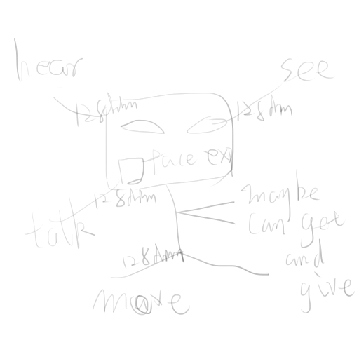
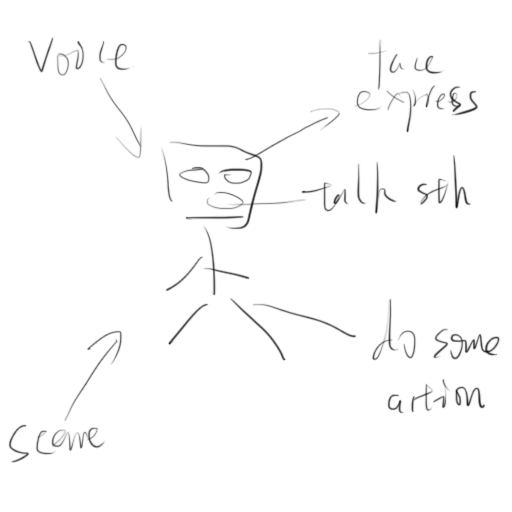
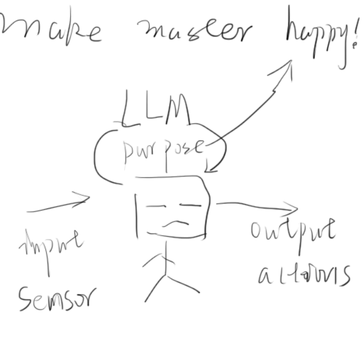

# this is a robot-making project that just for fun.
(sorry, poor English)

## guideline:
### divide the function
see, hear, talk, move, face expression
actually, to be simply, every function should use a vector space to connect to brain
so it just like this:

### difine the circulation

### purpose of this robot : make master happy !

globally, we need a hardware brain(an AI server) to complete the scene/audio to text(sense interpret) 
and text to text(input-react) and text to action(feeling expression), a platform connect sensor/action with brain 
(Raspberry Pi), a network module to transport signal between sensors and brain

ok let's begin

