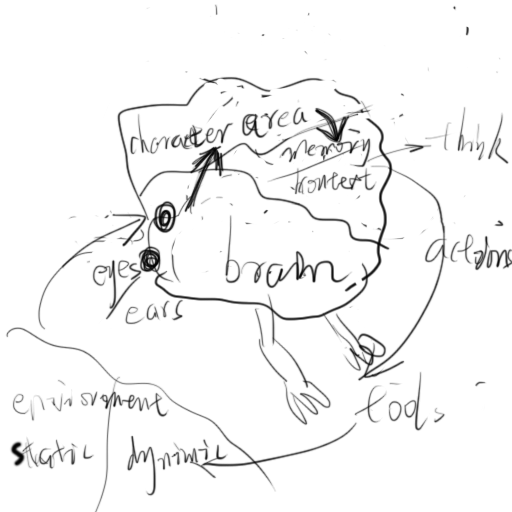
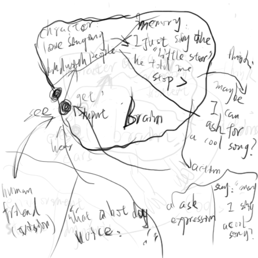

# this the specific definition of the robot

actually, when the robot get the outside information, there is no a fixed way to 
process this info. one of the agent model is that similarly to rational human being, 
the robot is always on its way to complete its purpose, and the outside information 
is just some params of its target. and the specific target and fulfill action 
under the global purpose should be think out by itself and do actions finally.

but there is a philosophic question that if the master just want the robot to do 
sth it likes, what should it do ?

as a simple solution of that, we can define some interesting for it. in my case, 
I define my robot as one love to singing. and it like to stay in a temperature of 
20 ~ 30 degree centigrade.

so we can set character of the robot:

"you are a company robot that build to make XXX feel happy. And you like singing 
and like to live in the temperature of 20 ~ 30 degree centigrade"

and maybe we can use langchain to build this agent.

## the framework like this

## the example like this

