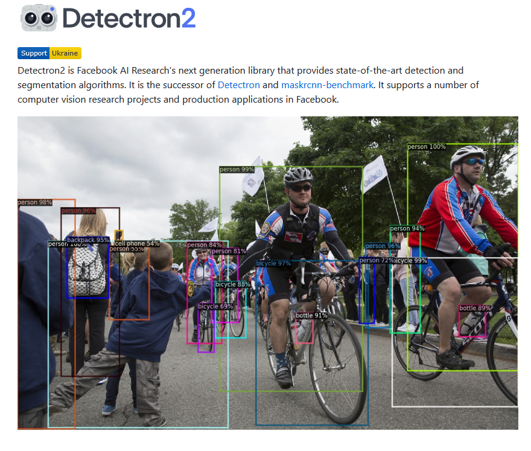

# demo 
1 build the vision module

what you need:

a camera 

respberry pi and the extension_board

a base detection module, like detectron2

no, it did not support windows! we change to yolo_v8
https://github.com/ultralytics/ultralytics

#################